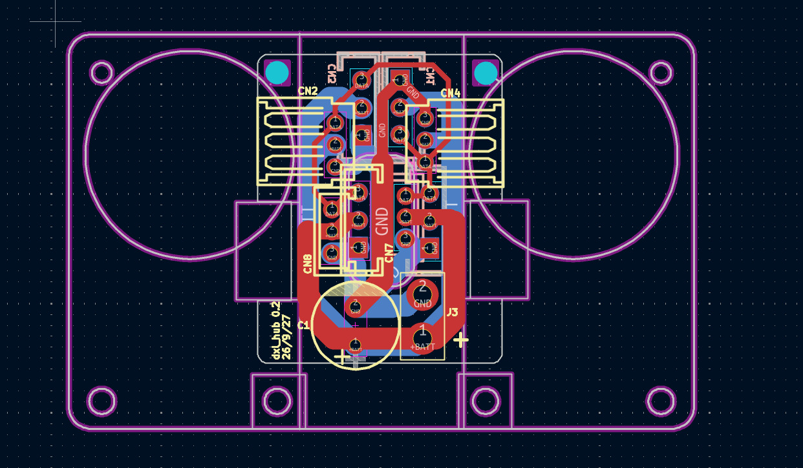
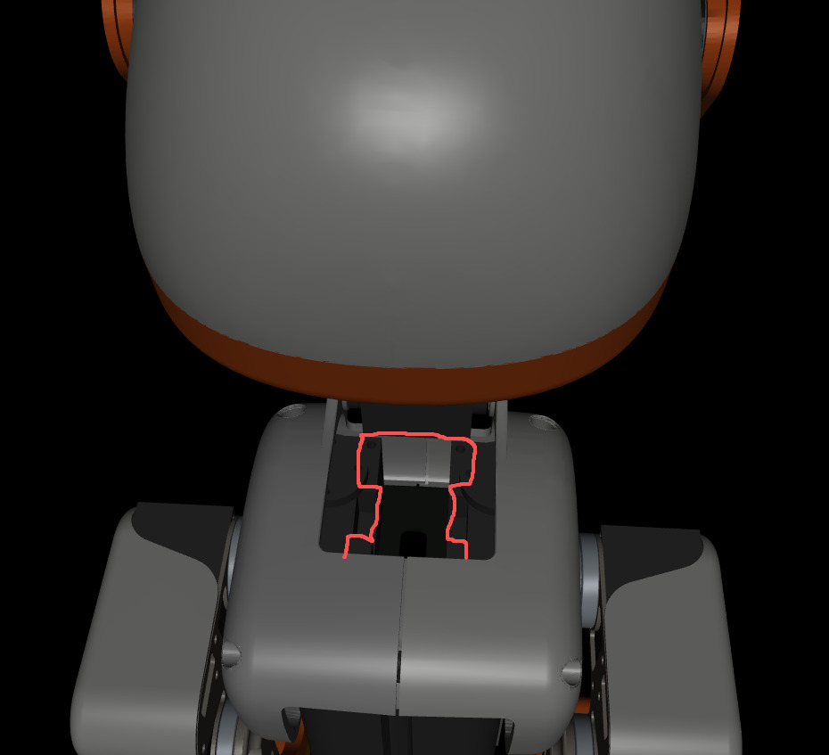

# "dxl_hub" 电力与数据分发板子

> "dxl_hub" 固定在机器鸭身体中舵机上方的板子。用于把电池电力分配到左右腿、头部和IMU。对单总线串口数据信号进行合并。

 - 根据需要焊接飞特1910舵机接口或XL330舵机接口，二选一。
 - 三个焊接在背面（两腿+IMU），一个正面（脖子）。
 - 注意：固定到舵机的两颗螺丝，最好用平头，不要用圆头，会有干涉。
 - 插座参考型号：
  - XL330用：B3B-EH-A(LF)(SN)，立式，
  - 飞特1910立式用：A2007WV-3P

## 其他信息
 - 使用KiCAD 9设计。
